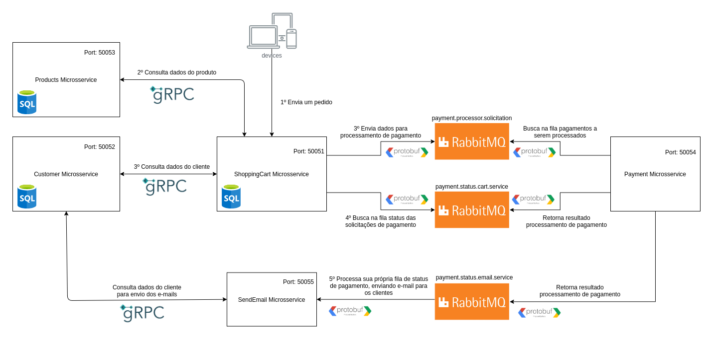
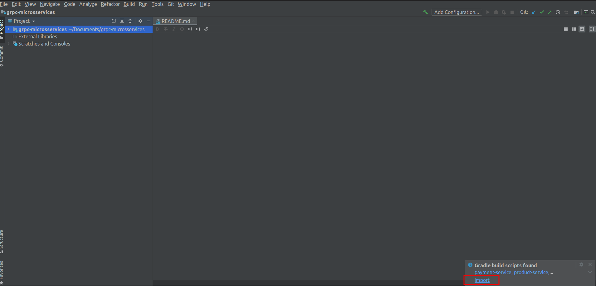
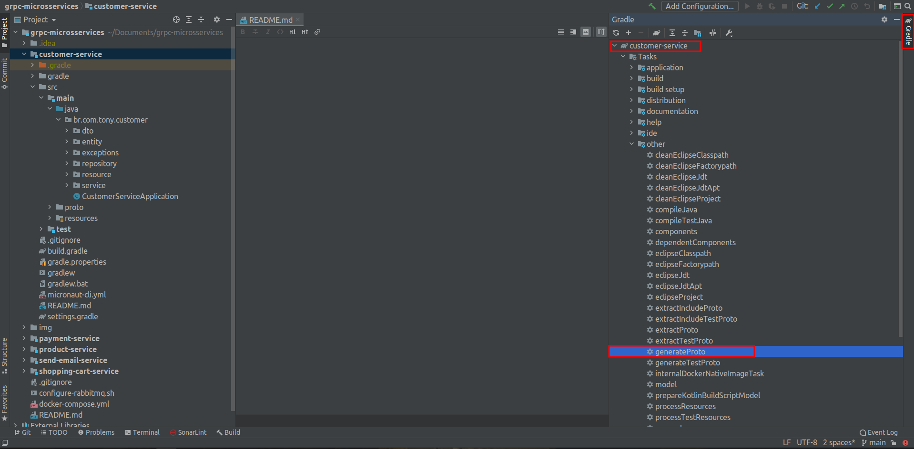
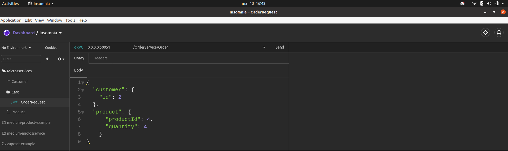

# [WIP] Este exemplo ainda está em desenvolvimento e foi testado somente em ambiente Linux Ubuntu.

## Fluxo do exemplo



### RabbitMQ e Protocol Buffers

Este exemplo utiliza o [Protocol Buffers](https://developers.google.com/protocol-buffers) para serializar os dados enviados para as filas RabbitMQ. Os formatos de mensagem foram definidos nos arquivos .proto e a serialização 
padrão do [Micronaut (Jackson)](https://micronaut-projects.github.io/micronaut-rabbitmq/latest/guide/#serdes) foi
sobrescrita para atender ao propósito deste exemplo. Os arquivos com a nova implementação estão no diretório /config dos serviços que comunicam com a fila.


#### Como executar

- Importe a pasta do projeto na sua IDE de preferência, no exemplo uso o Intellij Community:




- Feita a importação, execute para **cada um** dos serviços a task `generateProto`:



- No diretório raiz, execute o docker-compose.yml para subir as instâncias do RabbitMQ e Postgres;

- Com todos os contêineres em execução, agora precisamos configurar as exchanges e filas do RabbitMQ, para isso
execute os comandos abaixo dentro do diretório raiz dos projetos (mesmo nível onde está o docker-compose.yml):
    - `sudo chmod +x configure-rabbitmq.sh`
    - `./configure-rabbitmq.sh`

- Agora, execute a classe principal de **cada um** dos serviços e deixe-as executando;

- Para testar a comunicação utilize um client gRPC como o [Insomnia](https://insomnia.rest/), importe o arquivo
**order-service.proto** que está no diretório **shopping-cart-service/src/main/proto**, configure a porta gRPC como **0.0.0.0:50051** e selecione o método **order**:




-  O corpo da requisição deverá conter este formato:
``` javascript
{
    "customer": {
	    "id": 2
	},
	"product": {
			"productId": 4,
			"quantity": 4
		}
}
```

Credenciais de acesso ao RabbitMQ:
 - http://localhost:15672
 - usuário: user
 - senha: user

Os serviços com banco de dados possuem um script SQL básico que adiciona alguns dados para teste. No caso da requisição acima, o **shopping-cart-service** se comunicará com o **customer-service** e o **product-service** para obter respectivamente os dados de clientes e produtos. Em seguida, ele postará uma solicitação de pagamento
na fila RabbitMQ do **payment-service**, que após processá-lo enviará a resposta para as filas individuais do
**send-email-service** e **shopping-cart-service**. Você pode acompanhar tudo pelos logs impressos nos terminais de
execução dos serviços.
